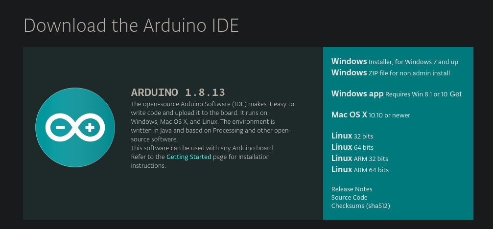
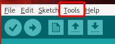
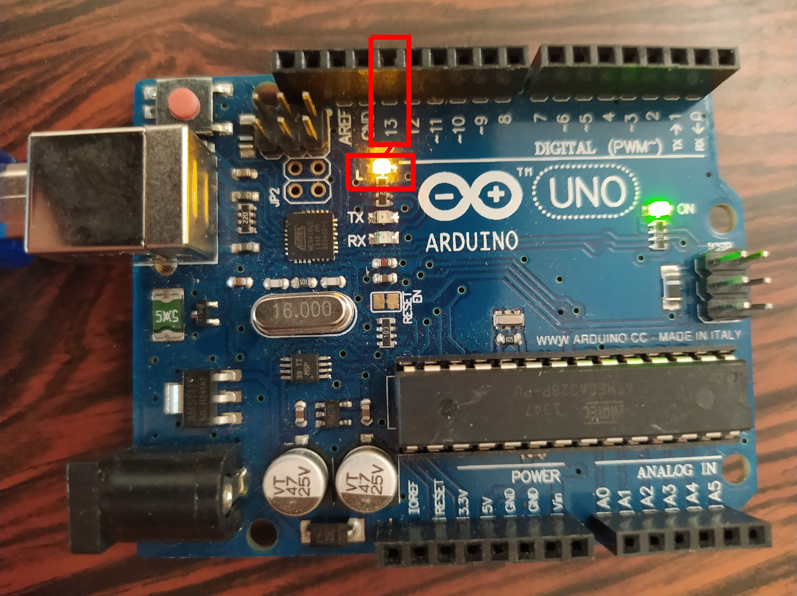
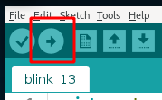

# Partie 0 - Introduction au développement sur arduino

## Table des matières
1) <a href="#title_arduino">Arduino ?</a>
2) <a href="#title_c">Pourquoi le C ?</a>
3) <a href="#title_electronique">L'éléctronique</a>
4) <a href="#title_arduinosoft">Logiciel arduino</a>
4) <a href="#title_analyse">Analyse des premières lignes de code</a>
5) <a href="#first_soft">Premier programme</a>
6) <a href="#index">Index</a>

## <a name="title_arduino">Arduino ?</a>
> Arduino est la marque d'une plateforme de prototypage open-source qui permet aux utilisateurs de créer des objets électroniques interactifs à partir de cartes électroniques matériellement libres sur lesquelles se trouve un microcontrôleur (d'architecture Atmel AVR comme l'Atmega328p, et d'architecture ARM comme le Cortex-M3 pour l'Arduino Due). 

(source [wikipédia](https://fr.wikipedia.org/wiki/Arduino))

Concrètement, un arduino est un petit circuit imprimé, qui sert à facilement et rapidement fabriquer des projets d'électroniques. La carte contient un petit processeur (Atmega328p pour les UNO, celui que vous avez dans votre kit), qui peut être programmé pour émettre des signaux électriques, ou les recevoir. Tout au long de ce kit, nous allons voir ensemble comment réaliser des circuits simples au moyen d'un arduino, ainsi que les bases du langage de programmation C.

## <a name="title_c">Pourquoi le C ?</a>
Le C est le langage le plus utilisé dans la programmation de systèmes embarqués, et le langage supporté par l'IDE `(Integrated Development Environment)` Arduino, que nous allons utiliser tout au long de ces projets. Le C est un langage puissant, qui offre un grand contrôle sur son environement au développeur, mais reste néanmoins très accessible pour une utilisation basique. Le C est un langage compilé, ce qui veut dire qu'il ne peut être exécuté qu'après avoir été transformé en langage machine (en binaire).

## <a name="title_electronique">L'éléctronique</a>
L'éléctronique est un vaste monde, rempli d'explosions surprises, d'éléctrocutions involontaires, et d'odeurs de brûlé. Les arduinos sont un bon moyen de lier le monde de l'électronique et le monde de l'informatique. Ils permettent une gestion de système éléctronique au moyen de la programmation.

## <a name="title_arduinosoft">Logiciel arduino</a>
La première étape dans le développement arduino est le logiciel Arduino, disponible sur le [site officiel](https://www.arduino.cc/en/Main/Software) d'arduino. Pour l'installation du logiciel, il suffit de choisir votre système dans la liste proposée :



Une fois le logiciel installé, vous pouvez le lancer et vous arriverez sur quelque chose qui ressemble à ceci :


1) Cette partie est le menu de l'IDE. C'est de là qu'on va pouvoir changer le type de carte que l'on veut programmer, ouvrir un fichier, le sauvegarder, ...
2) Cette partie possède les boutons d'actions qui permetterons de compiler le code, et de l'envoyer sur l'arduino, ainsi que des boutons pour ouvrir, sauvegarder et créer un nouveau fichier.
3) Cette partie est la plus importante, c'est celle dans laquelle nous écrirons le code C qui sera exécuté sur notre arduino. Par défaut, l'IDE écrit déjà quelque lignes. Nous allons les analyser un peu plus loin.
4) Cette dernière partie est la console. A cet endroit seront écrits des messages importants concernant la compilation[*](#index_compiler) du code et le transfert du code vers l'arduino.

### <a name="save">Enregistrement par projet</a>
Le logiciel Arduino IDE fonctionne par projet, c'est-à-dire que chaque fichier sauvegardé font partie d'un projet. Si vous souhaitez suivre le wiki, exercices par exercices, nous vous proposons de soit remplacé votre code à chaque exercices ou bien de faire un projet par exercice. Si vous faites tous les exercices dans le même projet, il risque d'y avoir des conflits entre les fichiers des différents exercices.

## <a name="analyse">Analyse des lignes de code par défaut</a>
Jetons un oeil aux lignes de code écrites par défaut par l'IDE :
```c
void setup() {
  // put your setup code here, to run once:

}

void loop() {
  // put your main code here, to run repeatedly:

}
```

Ce code est assez simple à comprendre :
Il consiste simplement en 2 fonctions; la fonction `setup` et la fonction `loop`.

La première, `setup` est appelée lorsque l'arduino s'allume (en général lorsqu'il est branché, ou qu'il vient d'être flashé[*](#index_flasher).). C'est dans cette fonction que l'on va définir les variables qui concernent l'environnement de l'arduino, ou que l'on va initialiser l'état de l'Arduino.

La seconde, `loop` est appelée en boucle tout le temps où l'arduino est allumé. C'est dans cette fonction que l'on va écrire le code qui va gérer le circuit éléctronique.

## <a name="first_soft">Première réalisation</a>
Pour réaliser ce premier exemple, vous n'aurez besoin que de 2 choses (en plus de votre pc et du logiciel arduino), le cable pour connecter l'arduino au pc et l'arduino en lui même.

### <a name="setup">Mise en place</a>
Premièrement, connectez votre arduino à votre PC au moyen du cable, puis vérifiez que votre arduino est bien détecté par le logiciel. Pour cette dernière étape, vérifiez la connection dans l'onglet `tool` du menu :



Dans cet onglet, vous aurez un sous-onglet `Port`. C'est dans ce dernier que vous pourrez vérifier que votre arduino est bien connecté à votre pc. Une fois cette étape terminée, vous pourrez commencer à écrire votre code.

### Faire clignoter une LED
La première chose que l'on va faire, va être de faire clignoter une LED sur l'arduino. Pour ce faire, aucun circuit éléctrique n'est nécessaire, on va juste faire clignoter une LED intégrée à l'Arduino.
Par défaut, la sortie 13 de l'Arduino est déjà liée à une led présente sur l'arduino. Cette LED est labellisée `L` comme vous pouvez le voir sur la photo ci-dessous:



#### Etape 1)
Pour ce faire, la première chose à faire va être de préciser à notre arduino comment nous souhaitons utiliser la pin 13. Pour ce faire, on va faire appel à la fonction `pinMode` qui est une instruction intégrée à l'IDE Arduino. Cette fonction prend 2 paramètres, l'identifiant de la pin que l'on souhaite utiliser, et un identifiant pour le type d'utilisation de cette pin. Ces valeurs peuvent être `INPUT`, pour spécifier que l'on souhaite recevoir du courant, et le lire, ou `OUTPUT` pour préciser que l'on souhaite faire sortir du courant par cette pin. Dans le cadre de ce premier bout de code, on souhaite faire sortir du courant par cette pin, afin d'allumer la LED correspondante.

On va donc préciser dans la fonction `setup` :

```c
void setup(){
    pinMode(13, OUTPUT);
}
```
**/!\ le point-virgule en fin de ligne est obligatoire !** Si vous l'oubliez, l'IDE vous mettra un message d'erreur comme celui-ci :
```
blink_13:3:1: error: expected ';' before '}' token
 }
 ^
exit status 1
expected ';' before '}' token
```

Ce message signifie que l'IDE, en lisant votre code pour le compiler a lu une accolade `}`, alors qu'il s'attendait à lire autre chose. La syntaxe de l'erreur est assez simple, et donne beaucoup d'informations sur la nature et l'emplacement de l'erreur. La première ligne : `blink_13:3:1: error: expected ';' before '}' token` se lit comme suit : "Dans le fichier *blink_13*, à la ligne `3`, au caractère `1`, il y a une erreur, un caractère `;` était attendu avant le caractère `}`.

####  Etape 2)
Ensuite, il va falloir passer aux choses sérieuses, et indiquer à notre Arduino que l'on souhaite allumer la LED en question. Pour ce faire, on va devoir faire sortir du courant par la pin 13. Pour modifier l'état d'une pin, il faut utiliser la fonciton suivante : `digitalWrite`. Les plus anglophone d'entre-vous aurons déjà compris ce que cette fonction fait; elle ecrit une valeur digitale sur la pin. Une valeur digitale signifie que la pin sera soit allumée, soit éteinte, il n'y a pas d'entre-deux. Cette fonction prend aussi 2 paramètres, la pin que l'on souhaite modifier, et l'état que l'on souhaite lui administrer. Les états possibles sont `HIGH`, ou "allumé", et `LOW`, ou éteint. Le code permettant alors d'allumer la LED `L` au lancement de l'arduino sera donc (avec le code précédant) :

```c
void setup(){
    pinMode(13, OUTPUT);
    digitalWrite(13, HIGH);
}
```

### Etape 3)
Nous allons enfin tester le code que nous venons d'écrire en le transférant sur l'Arduino. Pour ce faire, il suffit, une fois que l'arduino est correctement relié au PC (Voir <a href="#setup">Etape 1</a>), de cliquer sur le petit bouton avec un flèche.



A ce moment là, une petite barre de progression apparaitra en bas, vous indiquant où en est le téléversement<a href="#index_download">*</a>. Une fois ce dernier terminé, vous devriez voir la LED `L` s'allumer. Cela signifie que notre code a bien été envoyé sur l'arduino est s'est exécuté correctement.

### Etape 4)
Maintenant que l'on a réussi à allumer la LED, on va essayer de la faire clignoter plus ou moins vite. Pour ce faire, on va utiliser la fonction `loop`, inutilisée jusqu'à maintenant. Faire clignoter une LED n'est au final que l'allumer et l'éteindre plus ou moins vite. Vous avez donc normalement toutes les cartes en main pour écrire ce code vous même. L'approche basique pour faire ce programme, serait de faire un code comme le suivant :

```c
void setup(){
    pinMode(13, OUTPUT);
}

void loop(){ // Le code qui se répète tout le temps où l'arduino est allumé
    digitalWrite(13, HIGH); // On allume la LED
    digitalWrite(13, LOW); // On éteint la LED
}
```

Le résultat de ce morceau de code pourrait cependant vous étonner. Tout ce que vous verrez sera une LED allumée mais plus faiblement qu'avant. Ce qu'il se passe, c'est que la LED clignote bien, mais tellement vite que ses états allumés et éteint ne sont pas distinguables. Pour pouvoir distinguer l'état allumé de l'état éteint, il faut ralentir la vitesse d'exécution de notre code. Pour ce faire, on va utiliser la fonction `delay`, qui permet de faire un pause dans le code. Cette fonction prend un nombre en paramètre. Ce paramètre est le nombre de milliseconde pendant lesquelles le programe sera en pause. En ajoutant cette fonction entre nos fonctions `digitalWrite`, on va pouvoir faire alterner les états de la LED plus lentement. Le code ressemblera plus à quelque chose comme ça :

```c
#include <Arduino.h>

void setup(){
    pinMode(13, OUTPUT);
}

void loop(){ // Le code qui se répète tout le temps où l'arduino est allumé
    digitalWrite(13, HIGH); // On allume la LED
    delay(500); // On attend 500 millisecondes
    digitalWrite(13, LOW); // On éteint la LED
    delay(500); // On attend 500 millisecondes
}
```

Maintenant, notre led devrait s'allumer ou s'éteindre toutes les demi-secondes.

Voilà vous avez réussi à faire clignoter une LED sur votre arduino !

## <a name="index">Index</a>
* <a name="index_compiler">**Compiler**</a>: convertir du code d'un langage lisible pour un humain en langage machine
* <a name="index_flasher">**Flasher**</a>: Action de transférer un programme compilé sur la mémoire d'un arduino
* <a name="index_download">**Televerser**</a>: transférer le code compilé sur l'arduino
