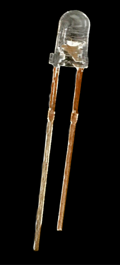
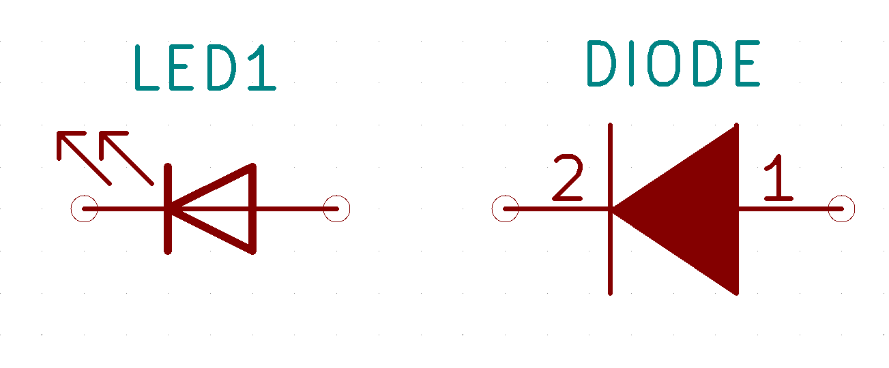
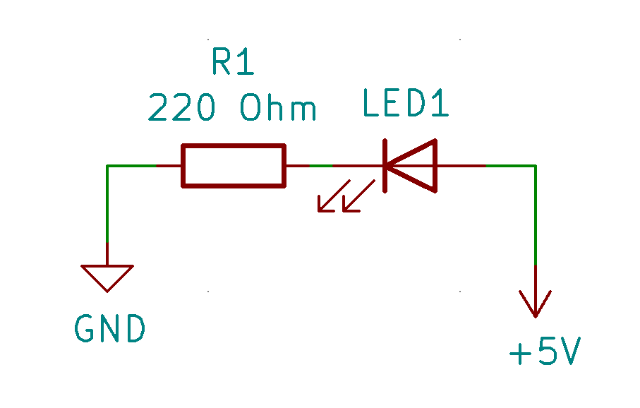
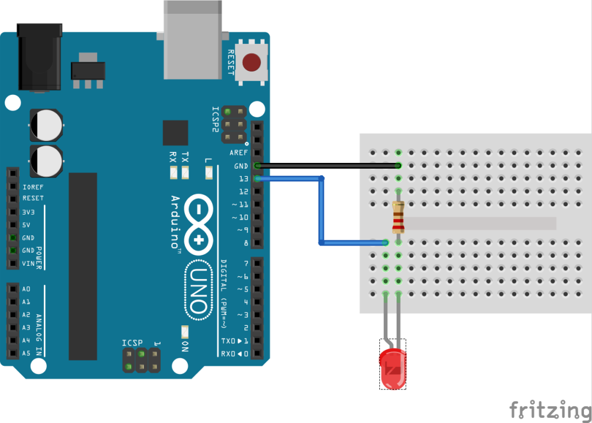
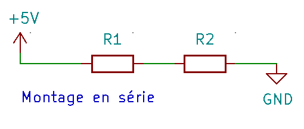
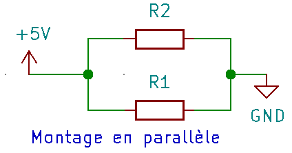

# Partie 01 - Les LEDS

Dans cette seconde partie, nous allons commencer à jouer avec des composants éléctroniques extérieurs à l'arduino.

## 1) (Re)faire clignoter une LED
La première chose que nous allons faire, est de faire comme dans la partie précédente, mais avec une LED extérieure à l'arduino. Pour réaliser cette partie, vous aurez besoin du matériel suivant :
* 1 * Arduino UNO
* 1 * LED (Rouge, verte ou bleue)
* 2 * Cable male-male 10cm
* 1 * résistance 220 ohm
* 1 * half-sized breadboard

### La LED
Une LED est une Diode Electroluminescente. Etant une diode, elle ne laisse passer le courant que dans un sens. Lorsque ce dernier traverse la diode, celle-ci émet de la lumière. Cela signifie que le sens d'une LED est important ! (voir <a href="#led_leg">image</a>)
Il faut également faire attention à la tension qui passe dans la LED (le voltage). Pour ceci, il faut utiliser une résistance, afin de réduire le voltage qui sort initialement de l'Arduino (+5V). On va donc devoir calculer la résistance nécessaire pour ne pas brûler la LED.

Différentiation des pattes d'une LED. La plus longue représente le côté qui se branche dans le **+**

Schéma éléctrique d'une LED et d'une diode (On peut clairement voir les similarités)

Vous avez probablement déjà vu que pour un circuit `V = RI` (Loi d'Ohm). Le <a href="#index_voltage">voltage</a> est égal à la <a href="#index_resistance">résistance</a> fois le <a href="#index_courant">courant</a>. Sachant qu'une LED consomme plus ou moins 20mA (0.02 <a href="#index_ampere">Ampères</a>) et qu'elle ne supporte pas plus de plus ou moins 2 <a href="#index_voltage">Volts</a>, on peut facilement calculer la résistance minimale qu'il faut utiliser pour éviter de brûler notre LED. Dans notre cas, sachant la loi d'Ohm, on sait que `R = V/I`, donc `R = (5-3)/0.02 = 100 Ohms`. Il faut donc une résistance minimale de 100 Ohms. Dans le cadre de ce kit, nous utiliserons des résistances de 220 Ohms, pour être sûr de ne rien brûler.

Pour utiliser cette résistance, il faut la placer en série avec la LED. La placer avant ou après celle-ci sur le circuit ne change rien. Les deux scémas suivant sont donc corrects.

les composants notés R1 et R2 sont des résistances

### Le circuit

Pour pouvoir faire clignoter cette LED depuis l'arduino, il va donc falloir faire un circuit avec celui-ci. Le circuit que l'on va faire est très simple, on va avoir besoin de :
* 2x Jumpers 10cm
* 1x LED (rouge, verte ou bleue)
* 1x Résistance 220 Ohm

La résistance va donc être <a href="#mount_serial">montée en série*</a> avec la LED. Comme vu plus haut, le sens dans lequel la résistance est mise par rapport à la LED n'a pas d'importance.

Le schéma sera donc le suivant :

Le code lui, ne changera pas. Vous voila donc avec un circuit qui fait clignoter une LED à l'aide d'un Arduino !

## Index
* <a name="index_voltage">**Voltage**</a>: Le voltage, ou tension, est la différence de potentiel entre deux bornes d'un <a href="#index_dipole">dipôle</a>.
* <a name="index_resistance">**Résistance**</a>: Composant (dipôle) régi par la loi d'Ohm, qui résiste au passage du courant.
* <a name="index_ampere">**Ampère**</a>: Un ampère est une unité de mesure de courant. Le courant représente les *"nombre d'électrons qui passe dans une section de cable par unité de temps"*
* <a name="index_dipole">**Dipole**</a>: Composant d'un circuit, possédant 2 pôles, une entrée et une sortie. (Exemples: une LED, une résistance, ...).
* <a name="mount_serial">**Monté en série**</a>: Deux composant montés en série sont montés l'un à la suite de l'autre de sorte à ce que le courant doive d'abord passer dans le premier composant puis dans le second.

* <a name="mount_Parallel">**Monté en parallèle**</a>: Deux composant montés en parallèle sont montés côte à côte, de sorte à ce que le courant puisse passer au travers des deux en même temps.

