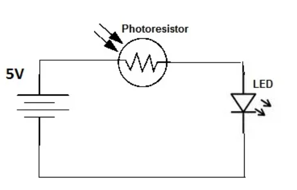
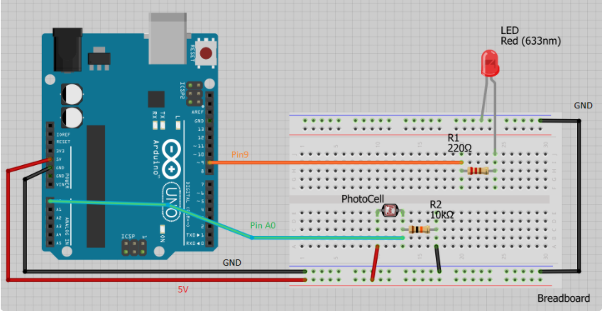

# Partie 4 - Utilisation d'une photorésistance

Une photorésistance ou photocellule est une résistance variable commandée par la lumière. La résistance d'une photorésistance diminue avec l'augmentation de l'intensité de la lumière incidente. Une photorésistance peut être appliquée dans des circuits de détection sensibles à la lumière et des circuits de commutation activés par la lumière et l'obscurité (Camera de nuit p.e.). Elle est également appelée résistance dépendante de la lumière (RDL).

# Etape 1: Comment utiliser une photorésistance


Voyons comment une photorésistance réagit à la lumière. Construisez le circuit ci-dessus et remarquez comment la luminosité des LED change.

La valeur de résistance diminue lorsqu'il y a beaucoup de lumière dans la pièce. Donc, dans l'obscurité, la led reste éteinte car la résistance est devenue très grande.

# Etape 2: Le Circuit

- Arduino uno
- Breadboard
- LED
- 220 Ohm & 10 KOhm resisteurs
- Photoresistreur



# Etape 3: Code

```c
/*
 *  Use a photoresistor (or photocell) to turn on an LED in the dark
 *  Author : Pinebook
*/


//Constants // fix values
const int pResistor = A0; // Photoresistor at Arduino analog pin A0
const int ledPin=9;       // Led pin at Arduino pin 9

//Variables // can change over time
int value;          // Store value from photoresistor (0-1023)

void setup(){
 pinMode(ledPin, OUTPUT);  // Set lepPin - 9 pin as an output
 pinMode(pResistor, INPUT);// Set pResistor - A0 pin as an input (optional)
 Serial.begin(9600); // Serial connector for numbers (optional)
}

void loop(){
  value = analogRead(pResistor); //read value

  Serial.println(value); //print serial (optional)
  if (value > 25){
    digitalWrite(ledPin, LOW);  //Turn led off
  }
  else{
    digitalWrite(ledPin, HIGH); //Turn led on
  }

  delay(500); //Small delay to let digital write finish (asym)
}

```

# Etape 4: Fin

Comme prochaine étape je vous sugère de remplacer la led rouge par 3 LEDs de couleurs différents et de illuster l'intensité de la lumière avec les 3 couleurs de LED.
